## Member

| No  | Nama                        | NRP        | Pengerjaan Soal |
| --- | --------------------------- | ---------- | --------------- |
| 1   | Marvelino Davas             | 5027251085 | Soal 11 - 20     |
| 2   | Nathania Tiara Wahyudi      | 5027251089 | Soal 1 - 10    |


### Soal 1: Konfigurasi Topologi & Interface
Untuk mempersiapkan pembangunan The Wired, Lain yang berperan sebagai Router membuat tiga Switch/Gateway: Switch 1 menuju dua Entitas yaitu Alice dan Mika, Switch 2 menuju Chisa, sedangkan Switch 3 menuju Knights dan Eiri. Kelima Entitas tersebut dikonfigurasi sebagai Client di GNS3.


Topologi dibuat dengan komponen berikut:

- NAT : sumber internet (DHCP) untuk router.
- Router Lain : terhubung ke NAT (`eth0`) dan ke tiga switch (`eth1`-`eth3`).
- Switch 1, 2, 3 : menghubungkan client ke router.
- Client (Alice, Mika, Chisa, Knights, Eiri) : simulasi client pada tiap subnet.

Prefix kelompok kami adalah `192.236.x.x`. Konfigurasi router pada **/etc/network/interfaces**:

```
auto eth0
iface eth0 inet dhcp

auto eth1
iface eth1 inet static
  address 192.236.1.1
  netmask 255.255.255.0

auto eth2
iface eth2 inet static
  address 192.236.2.1
  netmask 255.255.255.0

auto eth3
iface eth3 inet static
  address 192.236.3.1
  netmask 255.255.255.0
```

Konfigurasi tiap client (IP static dengan gateway ke router):

**Alice**

```
auto eth0
iface eth0 inet static
  address 192.236.1.10
  netmask 255.255.255.0
  gateway 192.236.1.1
```

**Mika**

```
auto eth0
iface eth0 inet static
  address 192.236.1.11
  netmask 255.255.255.0
  gateway 192.236.1.1
```

**Chisa**

```
auto eth0
iface eth0 inet static
  address 192.236.2.10
  netmask 255.255.255.0
  gateway 192.236.2.1
```

**Knights**

```
auto eth0
iface eth0 inet static
  address 192.236.3.10
  netmask 255.255.255.0
  gateway 192.236.3.1
```

**Eiri**

```
auto eth0
iface eth0 inet static
  address 192.236.3.11
  netmask 255.255.255.0
  gateway 192.236.3.1
```


### Soal 2: Konfigurasi Internet Router
Karena menurut Lain pada saat itu The Wired masih terisolasi dari dunia luar, konfigurasikan router Lain agar dapat tersambung langsung ke jaringan internet publik melalui NAT/DHCP pada interface eth0.

Interface `eth0` router yang terhubung ke NAT dikonfigurasi untuk mendapatkan IP dari DHCP:

```
auto eth0
iface eth0 inet dhcp
```

```sh
ifup eth0
/etc/init.d/networking restart
ping -c 4 8.8.8.8
```


### Soal 3: Konfigurasi IP Forwarding
Setelah router Lain terhubung ke internet, pastikan seluruh Entitas (Client) di bawah Switch 1, Switch 2, dan Switch 3 dapat saling terhubung dan berkomunikasi satu sama lain melalui konfigurasi routing.

Ketiga subnet sudah terhubung langsung ke router, sehingga yang perlu dilakukan adalah mengaktifkan IP forwarding pada router:

```sh
sysctl -w net.ipv4.ip_forward=1
echo "net.ipv4.ip_forward=1" >> /etc/sysctl.conf
sysctl -p
```

Kemudian test ping antar client:

**Alice ke Mika**


**Alice ke Chisa**


**Alice ke Eiri**


### Soal 4: Konfigurasi Firewall & NAT Masquerade
Lain ingin agar setiap Entitas (Client) memiliki kemandirian di The Wired. Konfigurasikan firewall/iptables (NAT Masquerade) dan DNS resolver agar setiap Client dapat terhubung ke internet secara mandiri (dapat melakukan ping ke 8.8.8.8 dan membuka domain web google.com).

Pada router dijalankan NAT Masquerade agar IP privat client diganti dengan IP `eth0` router, serta rule forward agar trafik client dapat keluar dan balasannya masuk kembali:

```sh
iptables -t nat -A POSTROUTING -o eth0 -j MASQUERADE
iptables -A FORWARD -i eth0 -m state --state ESTABLISHED,RELATED -j ACCEPT
iptables -A FORWARD -i eth1 -o eth0 -j ACCEPT
iptables -A FORWARD -i eth2 -o eth0 -j ACCEPT
iptables -A FORWARD -i eth3 -o eth0 -j ACCEPT
```

Pada setiap client ditambahkan DNS resolver:

```sh
echo "nameserver 8.8.8.8" > /etc/resolv.conf
```

Kemudian test dari client:

```sh
ping -c 4 8.8.8.8
ping -c 4 google.com
apk add curl
curl -sI http://google.com | head -n 1
```

**Ping ke 8.8.8.8**


### Soal 5: Script Verifikasi Status
Eiri tetap berupaya menanamkan kekacauan ke dalam jaringan. Untuk mengantisipasi restart tiba-tiba, pastikan seluruh konfigurasi jaringan tidak hilang saat semua node di-restart. Buat script verifikasi di /root/cek_status.sh pada router Lain yang menampilkan ringkasan interface (ip -br a) dan status tabel NAT (iptables -t nat -L -v -n) setelah reboot.

Agar tidak hilang saat restart, perintah `sysctl` dan `iptables` diletakkan sebagai direktif `up` pada **/etc/network/interfaces** router:

```
auto eth0
iface eth0 inet dhcp
  up sysctl -w net.ipv4.ip_forward=1
  up iptables -t nat -A POSTROUTING -o eth0 -j MASQUERADE
  up iptables -A FORWARD -i eth0 -m state --state ESTABLISHED,RELATED -j ACCEPT

auto eth1
iface eth1 inet static
  address 192.236.1.1
  netmask 255.255.255.0
  up iptables -A FORWARD -i eth1 -o eth0 -j ACCEPT

auto eth2
iface eth2 inet static
  address 192.236.2.1
  netmask 255.255.255.0
  up iptables -A FORWARD -i eth2 -o eth0 -j ACCEPT

auto eth3
iface eth3 inet static
  address 192.236.3.1
  netmask 255.255.255.0
  up iptables -A FORWARD -i eth3 -o eth0 -j ACCEPT
```

Pada setiap client, ditambahkan satu baris pada blok `eth0` agar DNS tetap ada setelah restart (contoh Alice, client lain sama):

```
auto eth0
iface eth0 inet static
  address 192.236.1.10
  netmask 255.255.255.0
  gateway 192.236.1.1
  up echo "nameserver 8.8.8.8" > /etc/resolv.conf
```

Script verifikasi pada router:

```sh
cat << 'EOF' > /root/cek_status.sh
#!/bin/bash
echo "=== Interface Summary (ip -br a) ==="
ip -br a
echo ""
echo "=== NAT Table (iptables -t nat -L -v -n) ==="
iptables -t nat -L -v -n
EOF

chmod +x /root/cek_status.sh
```

Setelah seluruh node di-restart, script dijalankan dan hasilnya menunjukkan IP interface dan rule `MASQUERADE` masih ada:

```sh
/root/cek_status.sh
```


### Soal 6: Traffic Generator
Mika mencurigai adanya anomali traffic pada segmen jaringannya. Jalankan generator traffic berikut (link file) pada node Mika, lalu lakukan packet sniffing menggunakan Wireshark pada interface node Mika. Terapkan display filter khusus untuk menyaring paket yang berprotokol DNS atau ICMP. Tunjukkan screenshot hasil filter beserta ringkasan paket yang lolos.

Download script pada Mika, lalu jalankan bersamaan dengan capture pada link Mika ke Switch 1:

```sh
apk add bash bind-tools
wget -O generator.sh "<LINK_FILE>" --no-check-certificate
chmod +x generator.sh
./generator.sh
```


Display filter yang digunakan pada Wireshark:

```
dns || icmp
```


### Soal 7: Konfigurasi FTP Server
Chisa memutuskan mendirikan FTP Server pada node miliknya dengan shared folder di /var/wired/data. Terapkan kebijakan akses: user alice (hak akses read & write), user mika (dibatasi read-only), dan user eiri (dibatasi tanpa izin akses / blacklist). Buktikan konfigurasi dengan membuat file signal_alice.txt dari user alice, dan buktikan penolakan akses saat user eiri mencoba login.

FTP Server menggunakan `vsftpd` pada node Chisa. Pertama install dan buat folder serta user:

```sh
apk update && apk add vsftpd
mkdir -p /var/wired/data

adduser -D -H -h /var/wired/data -s /bin/sh alice
adduser -D -H -h /var/wired/data -s /bin/sh mika
adduser -D -H -h /var/wired/data -s /bin/sh eiri
echo "alice:alice123" | chpasswd
echo "mika:mika123" | chpasswd
echo "eiri:eiri123" | chpasswd

chown alice:alice /var/wired/data
chmod 755 /var/wired/data
```

Kemudian konfigurasi `/etc/vsftpd/vsftpd.conf`:

```sh
cat << 'EOF' > /etc/vsftpd/vsftpd.conf
listen=YES
listen_ipv6=NO
anonymous_enable=NO
local_enable=YES
write_enable=YES
local_umask=022
pam_service_name=vsftpd
seccomp_sandbox=NO
local_root=/var/wired/data
chroot_local_user=YES
allow_writeable_chroot=YES
userlist_enable=YES
userlist_deny=YES
userlist_file=/etc/vsftpd.user_list
user_config_dir=/etc/vsftpd/user_conf
pasv_enable=YES
pasv_min_port=40000
pasv_max_port=40100
EOF
```

Kebijakan per user: `eiri` dimasukkan ke blacklist, dan `mika` dibuat read-only:

```sh
echo "eiri" > /etc/vsftpd.user_list
mkdir -p /etc/vsftpd/user_conf
echo "write_enable=NO" > /etc/vsftpd/user_conf/mika

vsftpd /etc/vsftpd/vsftpd.conf &
```


Test menggunakan user **alice** dari node Alice, dengan membuat file `signal_alice.txt`:

```sh
apk add lftp
echo "signal alice" > signal_alice.txt
lftp -u alice,alice123 192.236.2.10
lftp alice@192.236.2.10:/> put signal_alice.txt
```


### Soal 8: Upload Dokumen Laporan
Kelompok rahasia Knights perlu mengirimkan dokumen laporan intelijen ke FTP Server Chisa. Lakukan koneksi FTP client dari node Knights ke FTP Server Chisa menggunakan akun alice. Upload file berikut (link file). Analisis sesi Wireshark dan sebutkan: perintah FTP untuk upload (STOR), kode status sukses server (226), dan port data TCP yang dinegosiasikan pada mode PASV.

Dari node Knights, download file lalu upload ke FTP Server dengan akun alice, sambil capture pada link Knights ke Switch 3:

```sh
apk add lftp
wget -O knights_status_report.txt "<LINK_FILE>" --no-check-certificate
lftp -u alice,alice123 192.236.2.10
lftp alice@192.236.2.10:/> put knights_status_report.txt
```


Display filter pada Wireshark:

```
ftp || ftp-data
```


### Soal 9: Download Dokumen & Uji Read-Only
Mika mengakses dokumen Protokol Tujuh di (link file) dari FTP Server Chisa. Dari node Mika, unduh file tersebut menggunakan akun mika. Setelah itu, buktikan pembatasan read-only dengan mencoba mengunggah file baru dari akun mika, dan tunjukkan pesan error respon server (error 550 Permission denied) saat mika mencoba melakukan upload.

Pertama file diletakkan pada folder shared di node Chisa:

```sh
wget -O /var/wired/data/protocol_7_manifesto.txt "<LINK_FILE>" --no-check-certificate
chmod 644 /var/wired/data/protocol_7_manifesto.txt
```

Kemudian dari node Mika, download file dengan akun mika:

```sh
apk add lftp
lftp -u mika,mika123 192.236.2.10
lftp mika@192.236.2.10:/> get protocol_7_manifesto.txt
```


Lalu coba upload file baru untuk membuktikan read-only:

```sh
echo "Testing write permission from mika" > test_upload.txt
lftp mika@192.236.2.10:/> put test_upload.txt
```


Terlihat download berhasil, sedangkan upload ditolak server dengan respons `550 Permission denied`.


### Soal 10: Uji Ketahanan Latensi Jaringan
Knights melancarkan uji ketahanan koneksi ke server Chisa untuk menguji latensi jaringan The Wired. Kirimkan paket ping dari node Knights ke node Chisa dengan payload khusus 128 bytes dan interval 0.3 detik sebanyak 77 paket (ping -c 77 -s 128 -i 0.3 <IP_Chisa>). Buka Wireshark, catat nilai ICMP Type dan Code untuk Echo Request vs Echo Reply, serta analisis packet loss dan RTT (min/avg/max).

Jalankan ping dari Knights sambil capture pada link Knights ke Switch 3:

```sh
ping -c 77 -s 128 -i 0.3 192.236.2.10
```


Display filter pada Wireshark:

```
icmp && ip.addr == 192.236.2.10
```


### Soal 11: Kelemahan Protokol Telnet
Buktikan kelemahan protokol Telnet dengan membuat akun `phantom_user` dan password `wired_ghost` pada layanan telnetd di node Chisa. Lakukan login Telnet dari node Eiri ke node Chisa dan tangkap sesi menggunakan Wireshark. Tunjukkan kredensial plain text melalui fitur Follow TCP Stream, serta jelaskan mengapa setiap karakter terkirim dalam paket TCP terpisah.

Soal ini berbeda dari soal 14-20 karena capture dilakukan langsung dari topologi GNS3. Fitur Start capture pada GNS3 WebClient (browser) tidak dapat membuka Wireshark secara otomatis, sehingga capture dilakukan lewat **GNS3 Desktop Client** yang dihubungkan ke controller kelompok pada **Edit → Preferences → Controller** (host `10.4.89.250`, port `3080`).

Pertama, pada node Chisa dipasang layanan telnetd dan dibuat akun yang diminta. Pada Alpine, telnetd tersedia di paket `busybox-extras`:

```sh
apk add busybox-extras
adduser -D phantom_user
echo "phantom_user:wired_ghost" | chpasswd
telnetd -l /bin/login -p 23 &
```

Opsi `-l /bin/login` membuat telnetd meminta login memakai akun sistem, dan `-p 23` adalah port standar Telnet.

Kemudian, pada topologi klik kanan link **Chisa ke Switch 2**, pilih **Start capture**, dan Wireshark akan terbuka otomatis. Link ini dipilih karena Eiri (`192.236.3.11`) dan Chisa (`192.236.2.10`) berada di subnet berbeda, sehingga seluruh trafik menuju Chisa pasti melewati link tersebut.

Dari node Eiri lakukan login Telnet ke Chisa, masukkan kredensial, lalu keluar:

```sh
telnet 192.236.2.10
exit
```

Pada Wireshark, saring paket Telnet:

```
telnet
```

Filter ini membuang paket ARP dan TCP ACK yang tidak relevan. Pilih paket dari sesi login terakhir (yang berhasil sampai `exit`), lalu klik kanan → **Follow → TCP Stream**.

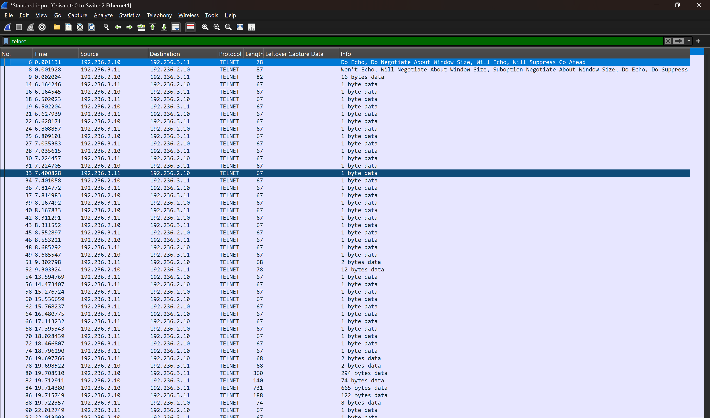

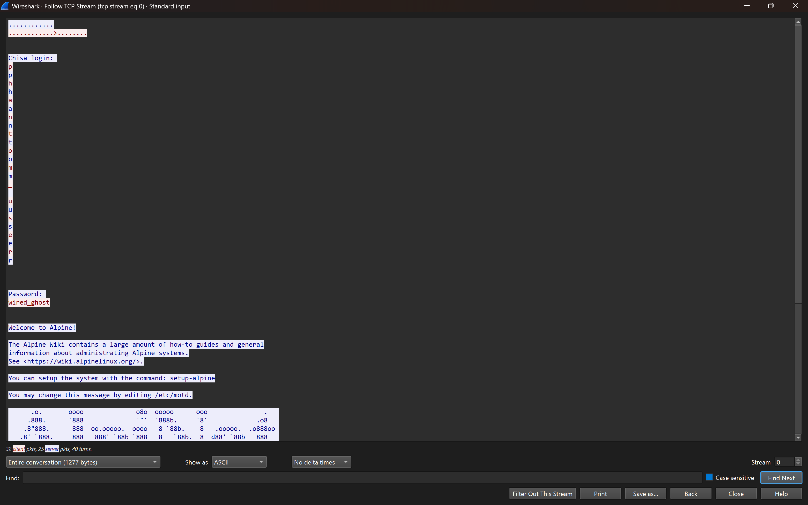

Hasil analisis: kredensial `phantom_user` dan `wired_ghost` terlihat sepenuhnya dalam bentuk plain text pada jendela Follow TCP Stream karena Telnet tidak melakukan enkripsi apa pun.

Setiap karakter terkirim dalam paket TCP terpisah karena Telnet secara default bekerja dalam mode **character-at-a-time**. Begitu satu karakter diketik, client langsung mengirimkannya tanpa menunggu Enter (berbeda dari protokol modern yang mem-buffer input per baris). Desain ini dibuat agar server dapat mengontrol echo secara real-time dan memproses karakter khusus seperti Backspace atau Ctrl+C secara langsung. Jejaknya terlihat pada kolom Info Wireshark yang berisi `1 byte data` berulang. Dari sisi keamanan, hal ini memperburuk kelemahan Telnet karena penyadap dapat merekonstruksi bukan hanya kredensial, tetapi juga pola dan kecepatan mengetik korban.


### Soal 14: Analisis Serangan Brute-Force (wired_bruteforce.pcapng)
File `wired_bruteforce.pcapng` merekam serangan brute-force pada form login web. Analisis file tersebut untuk menemukan IP penyerang, IP dan port target, password user `lain_admin` yang berhasil ditebak, serta web server beserta versinya dari response header. Validasi jawaban ke socket server pada port 3401.

Soal 14-20 berupa analisis file pcap yang disediakan asisten, sehingga seluruhnya dikerjakan di Wireshark tanpa konfigurasi node. Pola umumnya sama: baca pertanyaan soal, tentukan jenis paket yang menyimpan datanya, sempitkan dengan filter, lalu buka detail paket untuk mengambil jawaban.

Pertama, kumpulkan semua percobaan login. Form login dikirim dengan method POST dan brute-force berarti satu IP menembak form yang sama berulang kali:

```
http.request.method == "POST"
```

Kolom Source pada hasil filter ini adalah IP penyerang, dan kolom Destination adalah IP target.

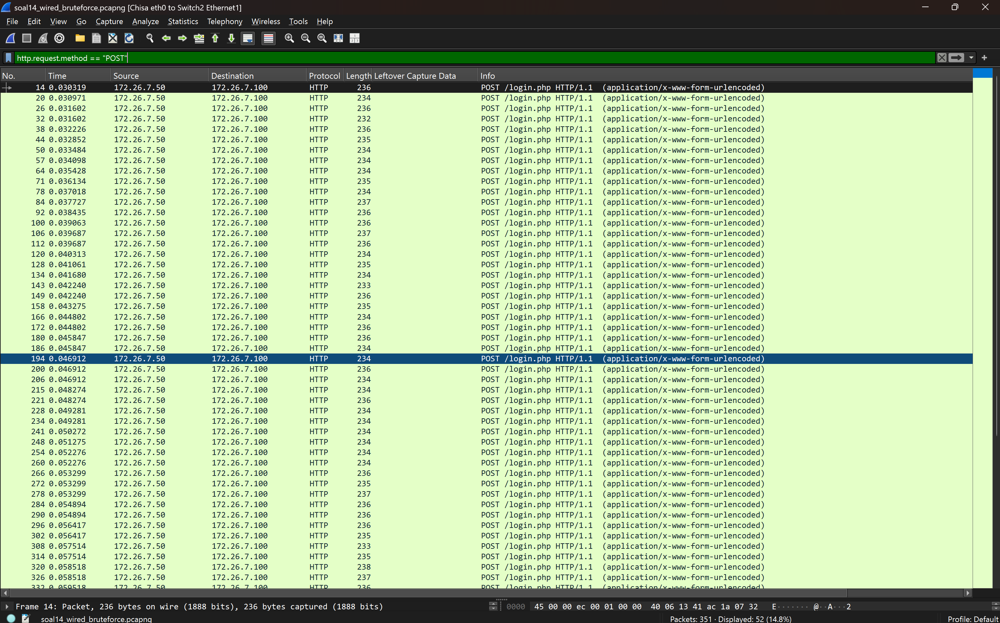

Kedua, cari percobaan yang berbeda dari yang lain. Hampir semua percobaan gagal dan dibalas `401 Unauthorized`, sehingga yang dicari justru pengecualiannya:

```
http.response.code != 401
```

Hasilnya tiga baris: No. 6 (`200 OK` ke `172.26.7.60`, pengunjung biasa), No. 209 (`404 Not Found` ke `172.26.7.92`, bukan login), dan **No. 351** (`200 OK` ke `172.26.7.50`). Paket 351 dipilih karena satu-satunya respons non-gagal yang tujuannya IP yang tadi melakukan POST berulang, sehingga IP penyerang terkonfirmasi `172.26.7.50`.

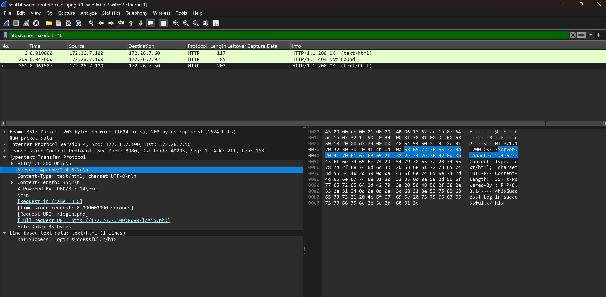

Ketiga, klik kanan paket 351 → **Follow → HTTP Stream**. Kolom Info hanya ringkasan satu baris, sedangkan body form login dan header response tersedia lengkap di Follow Stream. Body request memuat password yang berhasil, dan header response memuat baris `Server:`.

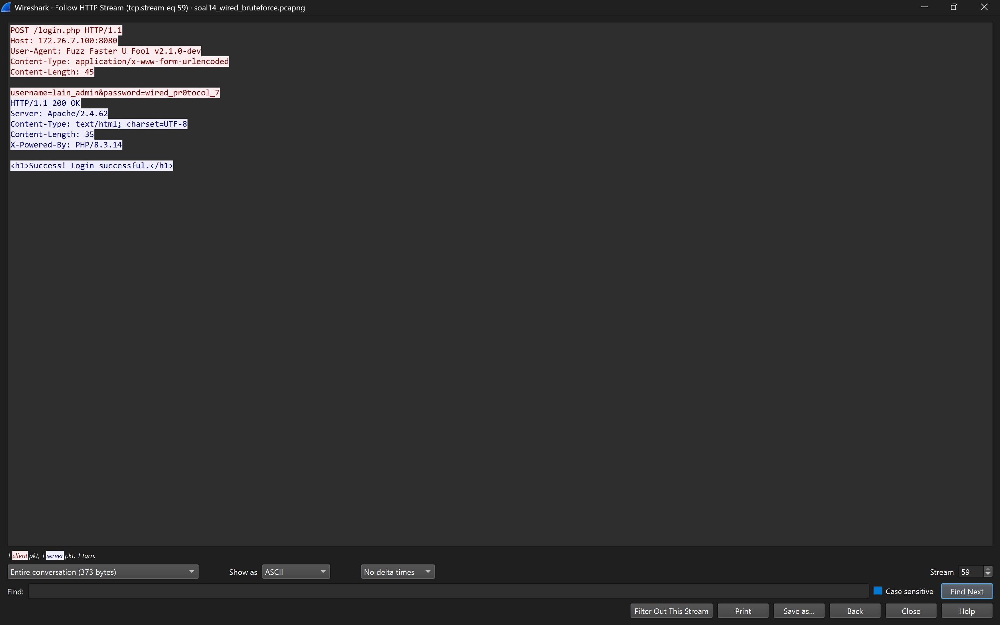

Keempat, port target dibaca dari detail TCP paket 351 (`Src Port`). Paket 351 adalah respons dari server, sehingga port layanan server ada di sisi Source. Port di sisi client bersifat acak dan bukan jawaban soal. Sebagai cross-check, pada salah satu paket POST port server berada di `Dst Port` dan bernilai sama.

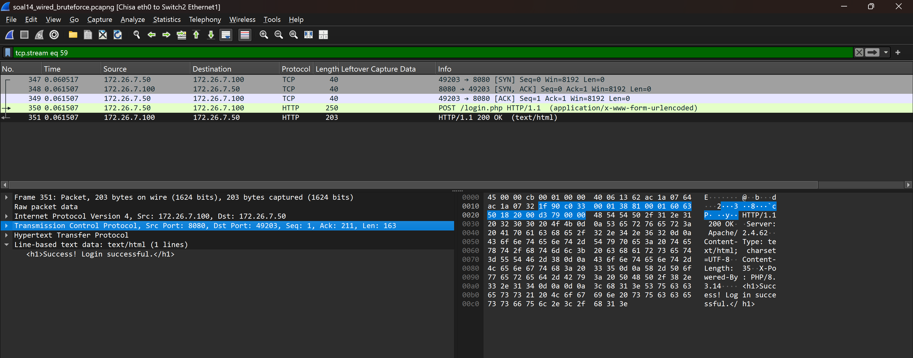

Validasi ke socket server:

```sh
nc 10.4.89.250 3401
```

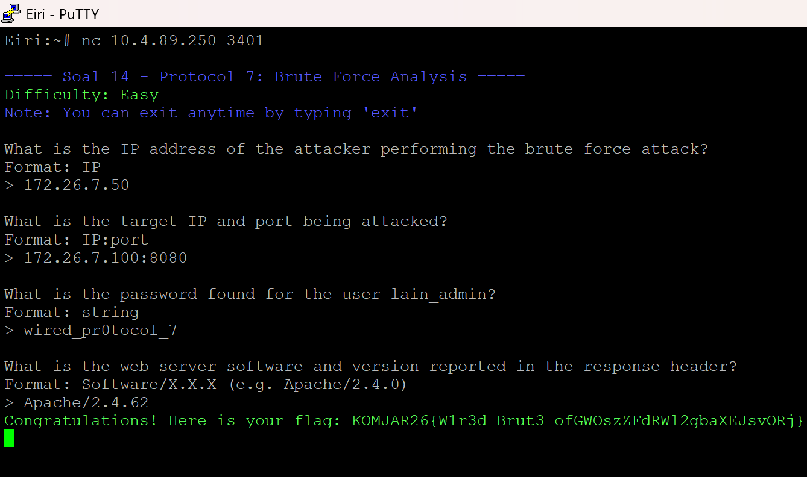

Hasil analisis:

- IP Penyerang: `172.26.7.50`
- Target IP:Port: `172.26.7.100:8080`
- Password berhasil (user `lain_admin`): `wired_pr0tocol_7`
- Web Server: `Apache/2.4.62`

Flag: `KOMJAR26{W1r3d_Brut3_ofGWOszZFdRWl2gbaXEJsvORj}`


### Soal 15: Analisis USB HID Keystroke (wired_usb_hid.pcap)
File `wired_usb_hid.pcap` merekam trafik dari perangkat USB keyboard. Temukan Vendor ID, Product ID, nomor device USB, dan pesan rahasia yang diketik dari data keystroke. Validasi jawaban ke socket server pada port 3402.

File ini terdiri dari dua fase yang dapat dibedakan dari kolom Info. Paket 1-24 berisi `GET DESCRIPTOR Request/Response`, yaitu fase device "berkenalan" dan mengumumkan identitasnya ke OS. Mulai paket 25 Info berubah menjadi `URB_INTERRUPT in`, yaitu fase pengiriman data keystroke. Vendor ID dan Product ID berada di fase pertama, sedangkan pesan rahasia berada di fase kedua.

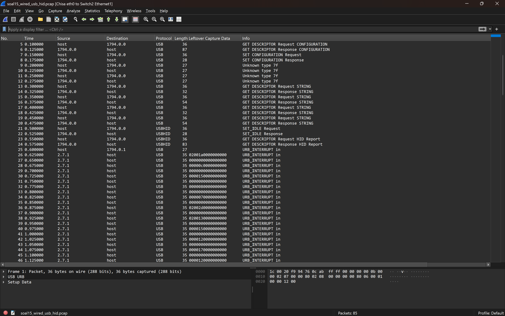

Untuk Vendor ID dan Product ID, buka **paket No. 2**, lalu expand **USB URB → DEVICE DESCRIPTOR** dan baca `idVendor` dan `idProduct`. Paket 1 adalah Request (host hanya bertanya) dan belum berisi identitas. Identitas dikirim pada paket Response bertipe DEVICE, yang pertama jatuh di paket 2.

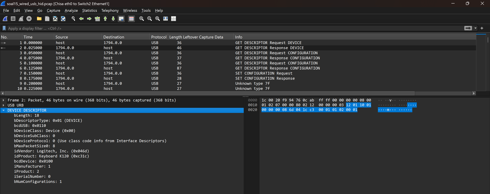

Untuk nomor device, buka salah satu paket keystroke (misalnya No. 26), expand **USB URB**, dan baca `Device address`. Pada paket 2 alamatnya masih `0`, yaitu alamat sementara sebelum OS memberi nomor resmi. Setelah proses kenalan selesai, device memakai alamat tetap `7` untuk mengirim keystroke. Soal menanyakan device yang mengirim pesan, sehingga yang dipakai adalah `7`. Sebagai cross-check, kolom Source paket keystroke bernilai `2.7.1` (bus.device.endpoint) dan bagian tengahnya sama dengan `7`.

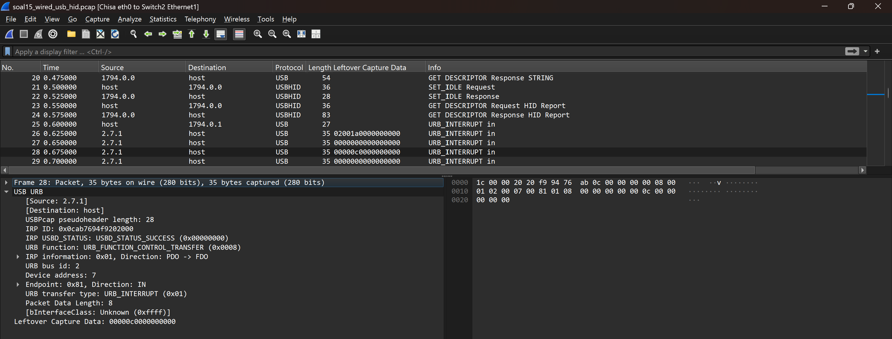

Untuk pesan rahasia, tampilkan hanya paket pembawa data keystroke:

```
usb.capdata
```

Kemudian klik kanan field **Leftover Capture Data** → **Apply as Column** supaya semua nilai hex terbaca dalam satu tabel. Setiap laporan keystroke berukuran 8 byte (16 karakter hex), dengan karakter 1-2 sebagai modifier (`02` berarti Shift ditekan) dan karakter 5-6 sebagai keycode tombol. Baris `0000000000000000` berarti tombol dilepas dan dilewati. Untuk huruf, keycode dalam desimal dikurangi 4 menghasilkan urutan huruf (0 = a). Angka `1`-`9` memakai keycode `1e`-`26`, angka `0` memakai `27`, dan `2d` dengan Shift menghasilkan `_`.

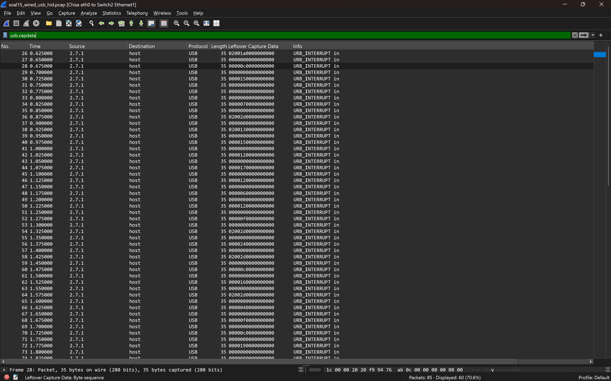

| No. | Modifier | Keycode | Perhitungan | Hasil |
|---|---|---|---|---|
| 26 | `02` | `1a` | 26 - 4 = 22, huruf w | W |
| 28 | `00` | `0c` | 12 - 4 = 8, huruf i | i |
| 30 | `00` | `15` | 21 - 4 = 17, huruf r | r |
| 32 | `00` | `08` | 8 - 4 = 4, huruf e | e |
| 34 | `00` | `07` | 7 - 4 = 3, huruf d | d |
| 36 | `02` | `2d` | tanda hubung dengan Shift | _ |

Proses yang sama dilanjutkan sampai baris terakhir. Ini adalah proses decoding lewat tabel USB HID Usage ID (layout keyboard US), bukan dekripsi, karena tidak ada kunci yang terlibat.

Validasi ke socket server:

```sh
nc 10.4.89.250 3402
```

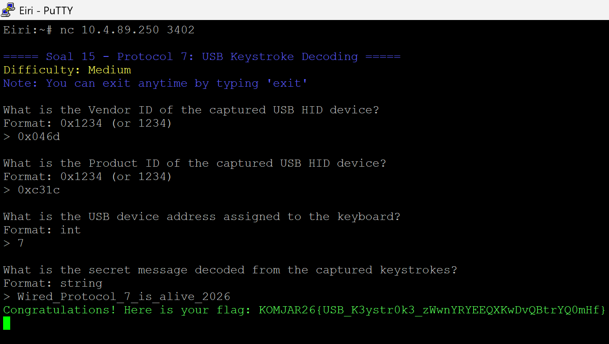

Hasil analisis:

- idVendor: `0x046d` (Logitech, Inc.)
- idProduct: `0xc31c` (Keyboard K120)
- Device address: `7`
- Pesan rahasia: `Wired_Protocol_7_is_alive_2026`

Catatan keamanan: Vendor ID dan Product ID diumumkan sendiri oleh device sehingga dapat dipalsukan. Device pada capture ini menyamar sebagai keyboard Logitech dan OS langsung mempercayai seluruh ketikannya.

Flag: `KOMJAR26{USB_K3ystr0k3_zWwnYRYEEQXKwDvQBtrYQ0mHf}`


### Soal 16: Analisis Pencurian Kredensial via FTP (wired_ftp_theft.pcap)
File `wired_ftp_theft.pcap` merekam pencurian file melalui FTP. Temukan IP server FTP yang dipakai untuk mengunduh malware, banner software FTP yang dikembalikan saat koneksi, kredensial yang dipakai penyerang untuk login (format `user:pass`), dan ukuran file `knights_payload.exe` dalam bytes. Validasi jawaban ke socket server pada port 3403.

FTP bersifat plain text sehingga command dan respons pada control channel langsung terbaca. Filter yang digunakan:

```
ftp
```

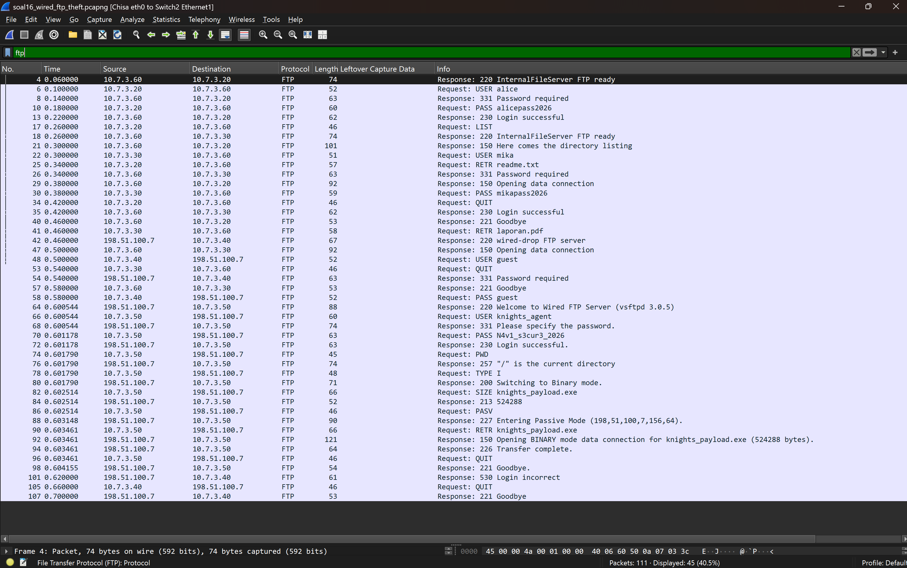

Hasilnya memuat lebih dari satu sesi, dan inilah inti kesulitan soal ini. `10.7.3.60` adalah `InternalFileServer` yang dipakai `alice` dan `mika` untuk file kantor (sesi legit), sedangkan `198.51.100.7` adalah server luar yang diakses dua client: `10.7.3.40` (login `guest`, berakhir `530 Login incorrect`) dan `10.7.3.50` (login `knights_agent`, berhasil).

**IP server FTP untuk download malware.** Cari `Request: RETR knights_payload.exe` (No. 90) dan lihat kolom Destination. `RETR` adalah command FTP untuk mengunduh file. Ada RETR lain (`readme.txt` No. 25 dan `laporan.pdf` No. 41), tetapi tujuannya server internal dan filenya bukan malware. Jawabannya `198.51.100.7`.

**Banner software.** Banner adalah response kode `220` yang dikirim server saat client baru tersambung, sebelum login. Ada tiga response `220`: No. 4 dari `10.7.3.60` (server internal, gugur), No. 42 dari `198.51.100.7` tetapi ke `10.7.3.40` (client `guest`) dengan teks `wired-drop FTP server` tanpa software dan versi (gugur), dan **No. 64** dari `198.51.100.7` ke `10.7.3.50` (client yang melakukan RETR malware) dengan teks `Welcome to Wired FTP Server (vsftpd 3.0.5)`. Pilihan yang benar diikat ke client yang sama dengan pelaku download malware.

**Kredensial.** Lihat `USER` (No. 66) dan `PASS` (No. 70) dari `10.7.3.50`, lalu cek response No. 72 (`230 Login successful`). Soal menanyakan kredensial yang dipakai untuk login yang berhasil, sehingga login `guest` yang berakhir `530` bukan jawabannya. Password bersifat case-sensitive, huruf pertama `N` kapital.

**Ukuran file.** Terdapat dua sumber pada sesi yang sama: No. 84 (response `213 524288` atas `SIZE knights_payload.exe`) dan No. 92 (response `150 ... knights_payload.exe (524288 bytes)`). Kedua sumber independen menunjukkan angka yang sama sehingga jawabannya aman. Pada socket server ditulis angkanya saja (format `int`).

Validasi ke socket server:

```sh
nc 10.4.89.250 3403
```

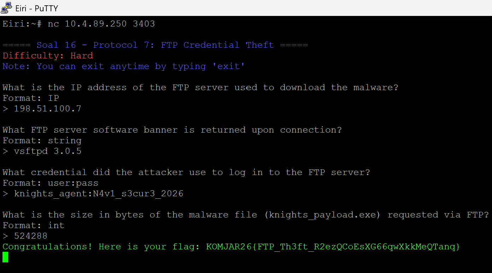

Hasil analisis:

- IP Server FTP Penyerang: `198.51.100.7`
- Banner Software: `vsftpd 3.0.5`
- Kredensial Login: `knights_agent:N4v1_s3cur3_2026`
- Ukuran `knights_payload.exe`: `524288` bytes

Flag: `KOMJAR26{FTP_Th3ft_R2ezQCoEsXG66qwXkkMeQTanq}`


### Soal 17: Analisis Unduhan Malware via HTTP C2 (wired_http_c2.pcap)
File `wired_http_c2.pcap` merekam komunikasi malware dengan server penyerang. Temukan domain (Host) yang dipakai untuk mengunduh malware, IP server penyerang, nama file executable, dan kode status HTTP. Validasi jawaban ke socket server pada port 3404.

Pertama, cari file yang diunduh. Download pada HTTP selalu diawali paket `GET` dari client:

```
http.request
```

Request yang meminta file berekstensi `.exe` adalah **No. 30**, yaitu `GET /navi_agent.exe`. Nama file executable-nya `navi_agent.exe` (tanpa `/` di depan karena itu hanya pemisah path pada URL).

Kedua, klik paket 30 lalu expand **Hypertext Transfer Protocol** untuk header `Host:`, dan lihat baris **Internet Protocol Version 4** untuk `Dst`. Header `Host:` berisi situs yang diminta client, sehingga menjadi sumber jawaban domain. Paket 30 dikirim client ke server, sehingga IP tujuannya adalah server penyerang.

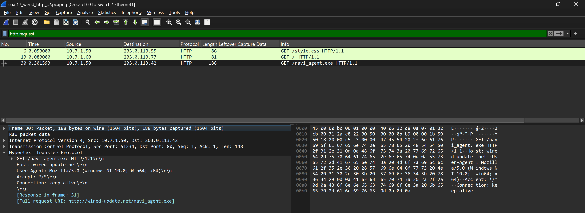

Ketiga, kode status dikirim server pada paket respons, bukan pada request. Wireshark menandai pasangannya pada baris `[Response in frame: 31]`. Pada paket 31, baris pertama HTTP berbunyi `HTTP/1.1 200 OK` dengan format `versi kode teks`, sehingga `200` adalah kode status dan `OK` hanya teks penjelasnya. Paket 31 dipilih (bukan `200 OK` lain seperti No. 17) karena terikat langsung ke request kita lewat `[Request in frame: 30]` dan dikirim dari `203.0.113.42` ke `10.7.1.50`. Sebagai cross-check, header `Content-Disposition` pada paket yang sama menyebut `filename="navi_agent.exe"`.

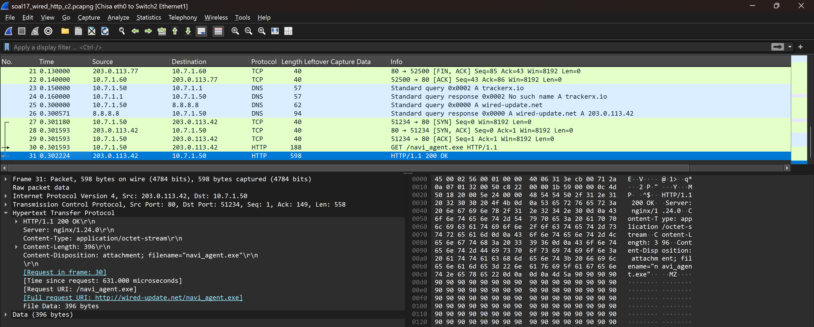

Keempat, verifikasi lewat DNS bahwa domain lain bukan pelakunya:

```
dns
```

Sebelum terhubung ke sebuah domain, client harus menanyakan IP-nya ke DNS, dan tanpa IP tidak ada tujuan koneksi sehingga tidak mungkin ada file yang diunduh. `trackerx.io` (No. 23-24) dibalas `No such name` sehingga merupakan pengecoh. `wired-update.net` (No. 25-26) dibalas `A 203.0.113.42`, lalu No. 27-29 berupa TCP handshake ke IP tersebut, kemudian No. 30 berupa `GET /navi_agent.exe`. Ini adalah pola khas unduhan malware: DNS berhasil, TCP connect ke IP hasil resolve, GET file, lalu 200 OK.

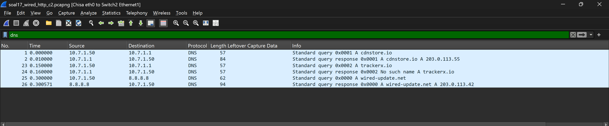

Validasi ke socket server (kode status ditulis angkanya saja):

```sh
nc 10.4.89.250 3404
```

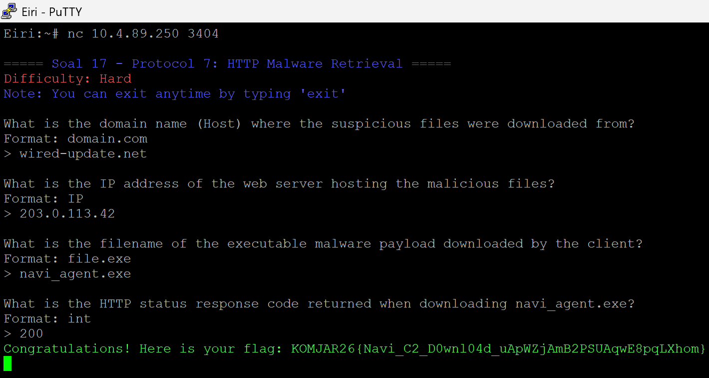

Hasil analisis:

- Domain (Host): `wired-update.net`
- IP Server Penyerang: `203.0.113.42`
- Nama File Executable: `navi_agent.exe`
- Kode Status HTTP: `200`

Flag: `KOMJAR26{Navi_C2_D0wnl04d_uApWZjAmB2PSUAqwE8pqLXhom}`


### Soal 18: Analisis Transfer Malware via SMB (wired_smb_transfer.pcapng)
File `wired_smb_transfer.pcapng` merekam transfer malware melalui jaringan. Temukan protokol yang dieksploitasi, IP pengirim dan penerima, folder tujuan file, dan nama file executable. Validasi jawaban ke socket server pada port 3405.

Tampilkan hanya trafik SMB versi 2:

```
smb2
```

Filter ini membuang paket TCP pendukung. Paket 4-10 (`Negotiate` dan `Session Setup`) adalah proses kenalan dan login, bukan inti transfer. Kolom Protocol menunjukkan `SMB2`, yang menjadi jawaban pertanyaan protokol.

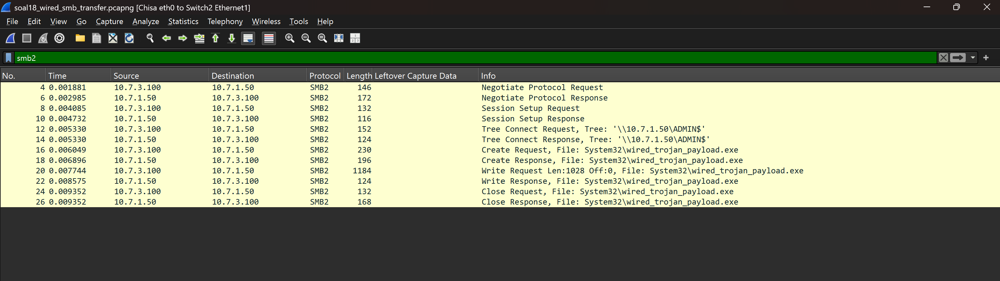

Transfer file di SMB terdiri dari tiga tahap berurutan, yaitu **Tree Connect** (masuk ke sebuah share di server), **Create** (membuat file baru di dalam share), dan **Write** (menulis isi file). Ketiganya muncul di No. 12, 16, dan 20. Pada SMB, Request dikirim oleh client dan Response oleh server.

**Tree Connect (No. 12):** `Tree Connect Request, Tree: '\\10.7.1.50\ADMIN$'` dikirim dari `10.7.3.100` ke `10.7.1.50`. IP di depan nama share adalah server yang dituju, sedangkan yang meminta koneksi adalah pengirim Request, yaitu `10.7.3.100`. `ADMIN$` adalah administrative share bawaan Windows yang menunjuk ke `C:\Windows` dan biasanya hanya dapat diakses dengan hak admin. `ADMIN$` adalah nama **share** (pintu masuk), bukan **folder**.

**Create (No. 16):** `Create Request, File: System32\wired_trojan_payload.exe`. Pada path ini bagian terakhir setelah `\` adalah nama file (ditandai ekstensi `.exe`), dan bagian sebelumnya adalah folder. Soal menanyakan folder, sehingga jawabannya `System32` saja, bukan `ADMIN$\System32`. Lokasi lengkapnya di komputer korban adalah `C:\Windows\System32`.

**Write (No. 20):** `Write Request Len:1028 Off:0` dari `10.7.3.100` ke `10.7.1.50`. Paket yang membawa data file menentukan arah pengiriman: `Len:1028` berarti 1028 bytes ditulis dan `Off:0` berarti penulisan dimulai dari byte pertama. Pengirim (penyerang) adalah `10.7.3.100` dan penerima (korban) adalah `10.7.1.50`. Paket 22 (`Write Response`) hanya konfirmasi dari server dan tidak menunjukkan arah file.

Validasi ke socket server (folder dijawab `System32` saja):

```sh
nc 10.4.89.250 3405
```

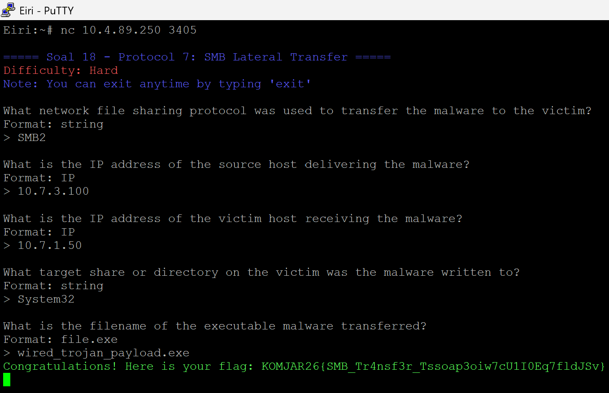

Hasil analisis:

- Protokol: `SMB2`
- IP Pengirim (Penyerang): `10.7.3.100`
- IP Penerima (Korban): `10.7.1.50`
- Folder Tujuan: `System32`
- Nama File Executable: `wired_trojan_payload.exe`

Flag: `KOMJAR26{SMB_Tr4nsf3r_Tssoap3oiw7cU1I0Eq7fldJSv}`


### Soal 19: Analisis Email Pemerasan via SMTP (wired_smtp_threat.pcap)
File `wired_smtp_threat.pcap` merekam email berisi ancaman pemerasan. Temukan email korban, password yang diklaim bocor, jenis malware, batas waktu (dalam hari), dan MailClientID. Validasi jawaban ke socket server pada port 3406.

SMTP adalah protokol pengiriman email dan bersifat plain text. Command (`MAIL FROM`, `RCPT TO`) hanya mengatur pengiriman, sedangkan isi email berada pada bagian `DATA`. File ini berisi 4 sesi email (kerjaan, laporan, spam, dan ancaman), sehingga sesi disortir lewat subject yang tampil di kolom Info:

```
smtp || imf
```

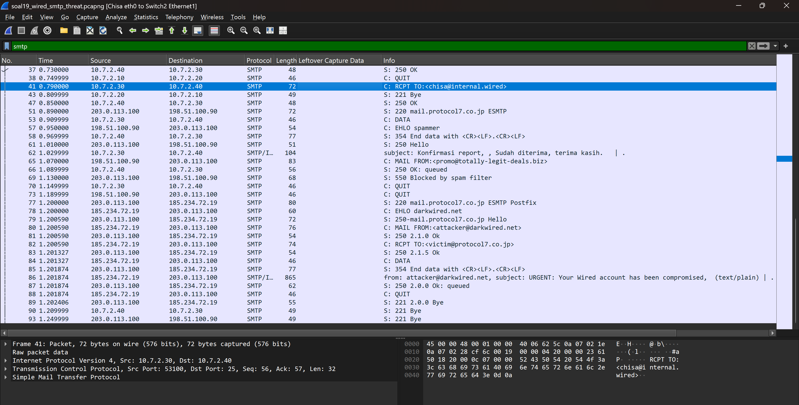

Soal membahas password bocor dan malware, sehingga sesi yang dipilih adalah yang bersubject `URGENT: Your Wired account has been compromised` dari `185.234.72.19`. Kemudian klik kanan paket pada sesi tersebut → **Follow → TCP Stream**. Kolom Info hanya menampilkan subject, sedangkan body email dipecah di beberapa paket. Follow Stream menyatukannya sehingga seluruh jawaban dapat dibaca pada satu jendela:

- Email korban: `victim@protocol7.co.jp` (baris `To:` dan `RCPT TO`)
- Password yang diklaim bocor: `pr0tocol_7_user` (kalimat `I know that: ... is your password!`)
- Jenis malware: `ransomware` (kalimat `Your computer was infected with my private ...`)
- MailClientID: `7719980706` (baris terakhir sebelum tanda titik akhir DATA)

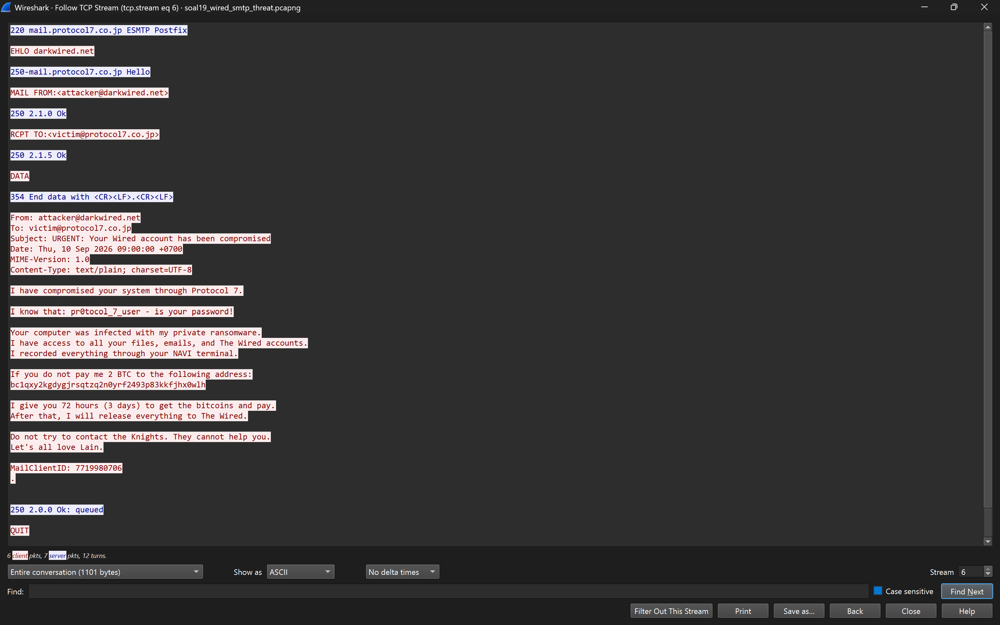

Kata `Protocol 7` adalah nama sistem yang diklaim dibobol dan `NAVI terminal` adalah nama perangkat korban, keduanya bukan jenis malware. Jenis malware juga sesuai dengan perilaku ancamannya, yaitu file korban disandera lalu diminta tebusan 2 BTC.

Untuk batas waktu, email menulis `72 hours (3 days)` sedangkan soal meminta jawaban dalam hari, sehingga jawabannya `3`. Satuan yang diminta soal selalu dicocokkan dengan yang tersedia pada sumber data.

Validasi ke socket server:

```sh
nc 10.4.89.250 3406
```

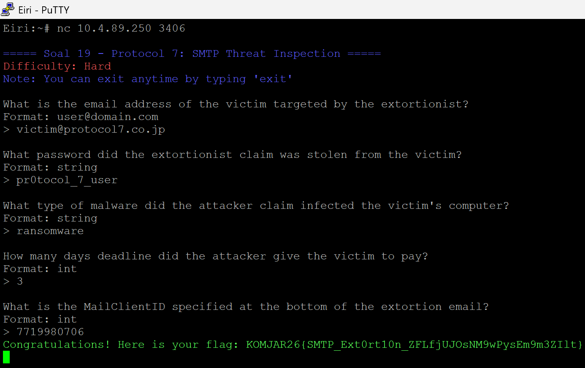

Hasil analisis:

- Email Korban: `victim@protocol7.co.jp`
- Password yang Diklaim Bocor: `pr0tocol_7_user`
- Jenis Malware: `ransomware`
- Batas Waktu: `3 hari` (dari 72 jam)
- MailClientID: `7719980706`

Flag: `KOMJAR26{SMTP_Ext0rt10n_ZFLfjUJOsNM9wPysEm9m3ZIlt}`


### Soal 20: Analisis TLS Decrypt (wired_tls_decrypt.pcapng)
File `wired_tls_decrypt.pcapng` merekam sesi HTTPS dan disertai file `keyslogfile.txt`. Temukan versi TLS, SNI domain, IP server HTTPS, User-Agent, serta method dan path HTTP yang tersembunyi. Validasi jawaban ke socket server pada port 3407.

TLS dirancang agar isi trafik tidak terbaca tanpa kunci sesi, tetapi tidak semua bagian terenkripsi. Handshake (Client Hello dan seterusnya) dikirim sebelum enkripsi aktif sehingga sebagian jawaban sudah dapat diambil tanpa kunci. Pada kondisi awal (tanpa keylog), paket 6 dan 7 tampil sebagai `Application Data` (terenkripsi), dan jawaban yang sudah dapat diambil adalah:

- Versi TLS: `TLSv1.2` (kolom Protocol)
- SNI: `example.com` (Info paket 1, `Client Hello (SNI=example.com)`). SNI adalah nama domain yang ditulis client pada Client Hello supaya server tahu situs mana yang diminta
- IP server HTTPS: `93.184.216.34` (Destination paket 1, port tujuan `443`)

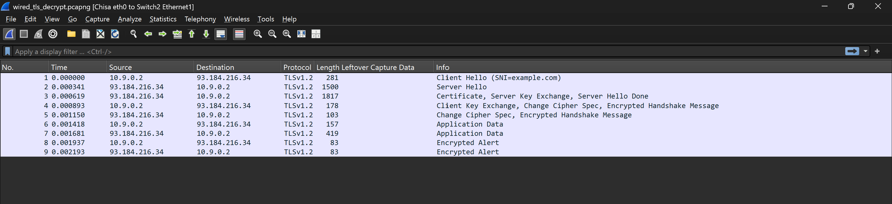

Kemudian pasang kunci sesi pada **Edit → Preferences → Protocols → TLS**, isi **(Pre)-Master-Secret log filename** dengan `keyslogfile.txt`, lalu OK. File ini berisi kunci sesi (analog dengan `SSLKEYLOGFILE` pada browser). Setelah dipasang, Wireshark mendekripsi ulang seluruh paket, dan paket 6 dan 7 berubah dari `Application Data` menjadi HTTP (`HEAD /` dan `200 OK`). Inilah maksud kata "tersembunyi" pada soal, karena method dan path baru terlihat setelah dekripsi.

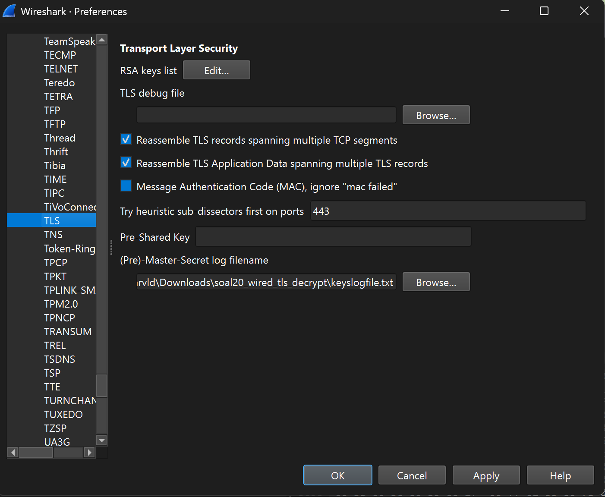

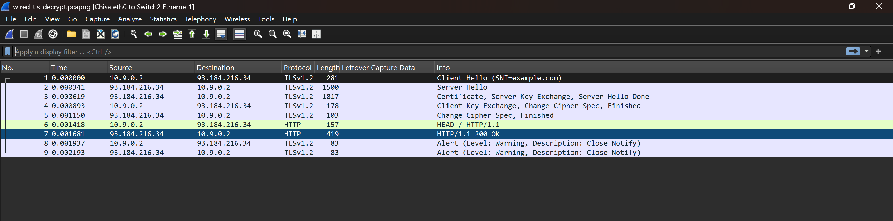

Selanjutnya klik paket 6 dan expand **Hypertext Transfer Protocol** untuk mengambil `User-Agent` serta method dan path pada baris pertama.

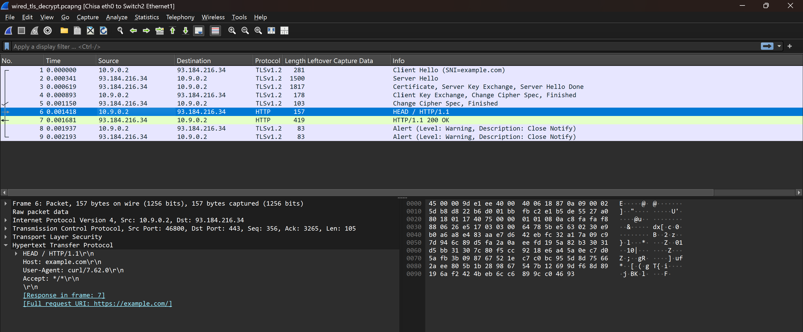

Body response tampak kosong meski header memuat `Content-Length`. Hal ini bukan kegagalan dekripsi, melainkan karena method yang digunakan adalah `HEAD`, yang secara desain hanya meminta header tanpa body.

Validasi ke socket server:

```sh
nc 10.4.89.250 3407
```

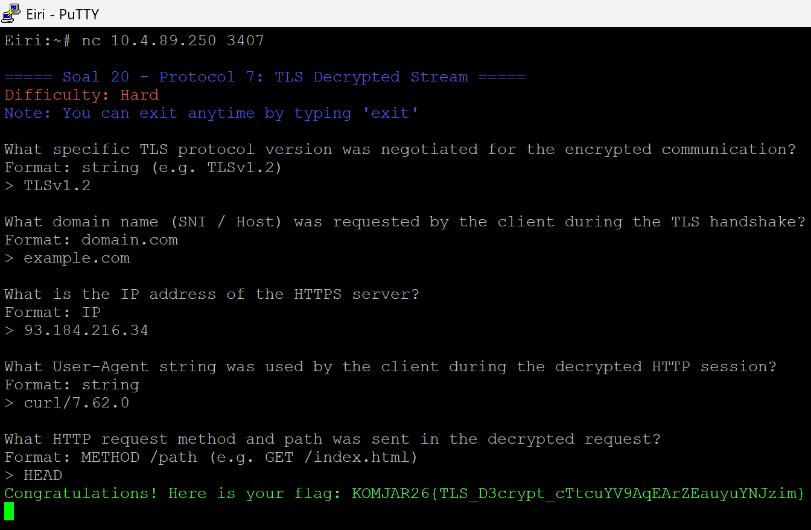

Hasil analisis:

- Versi TLS: `TLSv1.2`
- SNI Domain: `example.com`
- IP Server HTTPS: `93.184.216.34`
- User-Agent: `curl/7.62.0`
- HTTP Method dan Path: `HEAD /`

Flag: `KOMJAR26{TLS_D3crypt_cTtcuYV9AqEArZEauyuYNJzim}`